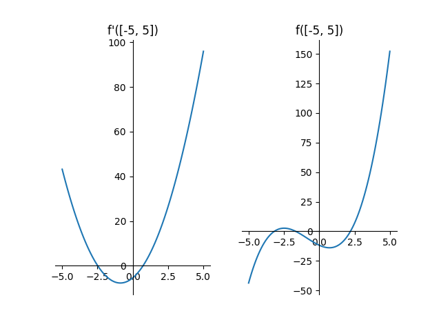

# Лабраторная работа 2: Численное решение нелинейных уравнений и систем

## Цель работы

Изучить численные методы решения нелинейных 
уравнений и их систем, найти корни заданного 
нелинейного уравнения/системы нелинейных уравнений, 
выполнить программную реализацию методов.

## Ход работы

### Задача

Номер варианта: 18.

Вид функции f: 
$f(x) = x ^ 3 + 2.64 \cdot x ^ 2 − 5.41 \cdot x − 11.76$

### Отделение корней графически 

Построим график исходной функции и ее производной,
что позволит нам графически выделить интервалы
изоляции корней.

Производная функции:
$f'(x) = 3 \cdot x ^ 2 + 2 \cdot 2.64 \cdot x - 5.41$

По графику видно, что уравнение имеет три корня.
Так как количество корней многочлена не превосходит
его степень, то все корни наблюдаемы при выбранном 
масштабе графиков.

Становятся очевидны интервалы изоляции корней: 
$(-4, -2), (-2, 0), (1, 3)$. Важно также упомянуть,
что изолированность корней очевидна ввиду 
конечности их количества (сможем выбрать 
дельта-окрестность корня, положив дельту равной 
минимальному из расстояних от него до остальных 
корней).

### Вычисления корней

Вариант: 18
- Крайний правый корень - 3 метод: 
  Метод Ньютона  
- Крайний левый корень - 5 метод: 
  Метод простой итерации
- Центральный корень - 2 метод: 
  Метод хорд

